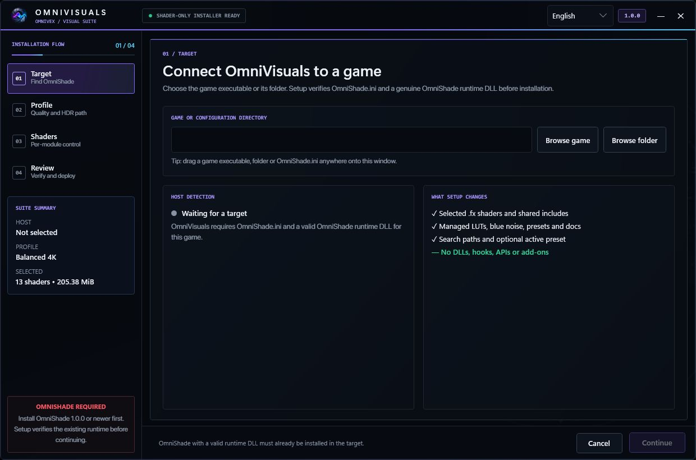

  

<h1 align="center">OmniVisuals</h1>

<strong>A coherent visual suite for OmniShade — 4K-focused lighting, reflections, atmosphere, reconstruction, color and HDR with clear performance paths.</strong>

Part of the <a href="#the-omnivex-suite">OmniVex</a> suite.

  
  &nbsp;
  

<!-- Suite metadata: Version · Platform · Languages · Telemetry · Distribution -->

  
  
  
  
  

<!-- Quick navigation. These chips jump to a README section or maintained
     document. Keep fragment links aligned with GitHub's heading slugs. -->

  
  
  
  
  
  
  
  
  

> [!IMPORTANT]
> **Documentation-only repository.** This public repository contains OmniVisuals documentation, approved artwork, and screenshots—not shader source, textures, presets, installers, or release archives. Official distribution remains outside GitHub.

## One suite, one rendering language

OmniVisuals is an original clean-room shader suite designed specifically for OmniShade. Its effects share depth, motion, scene-cut, HDR and temporal conventions so the stack behaves as one pipeline instead of a folder of unrelated filters.

### Highlights

- **SingularityRT** — fused diffuse GI, visibility/contact AO, bent normals and roughness-aware reflections with Efficient and Quality paths.
- **NebulaGI + QuasarSSR** — separate high-control GI/AO and stochastic screen-space reflection route.
- **VectorNova + TemporalNexus** — motion estimation fallback, scene-cut state, reactive masks and HUD protection.
- **AstralVolume, SingularityDOF and CoronaBloom** — volumetrics, cinematic depth of field and controlled bloom/halation.
- **Photon AA/reconstruction family** — spatial or temporal anti-aliasing, clarity and chroma-preserving sharpening.
- **SpectraPilot, ChromaticOrbit and PrismLUT** — adaptive looks and managed LUT workflows.
- **NovaHDR** — SDR, scRGB, PQ and HLG-oriented output handling with conservative gamut protection.
- **SupernovaFinish** — fused finishing path that reduces separate 4K passes.
- Performance, Balanced 4K, Ultra 4K, Singularity and Fused profiles.
- Shader-only installation: no DLLs, hooks, APIs or add-ons.
- English, German, Spanish, French and Romanian installer UI.

## Honest rendering boundary

Screen-space effects cannot see hidden/off-screen geometry or reconstruct data the game never exposes. AutoLook cannot know monitor calibration or artistic intent from pixels alone. OmniVisuals supplies robust starting points, not a universal one-click guarantee.

## Requirements

OmniVisuals requires Windows 11 and OmniShade 1.0.0 or newer in the target
game. Setup verifies the configuration and runtime before installation.
Windows 10 may still run, but it is no longer an active development or release-
qualification target. Results and cost depend on resolution, GPU, game buffers,
HDR mode and selected effects.

## Get OmniVisuals

OmniVisuals 1.0.0 is **free donationware**: payment is not required, there are no ads, and support is entirely optional. If it is useful to you and you want to fund continued work, use either official page:

  
  &nbsp;&nbsp;
  

GitHub contains no source, installer release or download mirror.

## Documentation

- [Feature overview](FEATURES.md)
- [Shader guide](SHADERS.md)
- [Privacy](PRIVACY.md)
- [Frequently asked questions](FAQ.md)
- [Support](SUPPORT.md)
- [Security](SECURITY.md)
- [Contributing](CONTRIBUTING.md)
- [1.0.0 highlights](CHANGELOG.md)
- [Documentation license](LICENSE.md)
- [Repository and licensing notice](REPOSITORY_NOTICE.md)

## The OmniVex suite

OmniVisuals is one of a family of tools sharing a design language and a philosophy —
modern, fast, no telemetry:

**OmniTheme** · **OmniBlock** · **OmniCleaner** · **OmniAPO** · **OmniEQ** · **OmniPlay** · **OmniScale** · **OmniShade** · **OmniVisuals** · **OmniGPU** · **OmniWrappers**

**OmniWrappers** is four Direct3D compatibility installers — OmniDXVK, OmniDxWrapper, OmniVKD3D and OmniVoodoo2.

Tuned for framerate, mixed for headroom, sharp to the pixel. Donationware
tools for gamers and audiophiles — audio, graphics, and a bit of privacy too.

More at [github.com/TheOmniGrid](https://github.com/TheOmniGrid).

---

## Credit

**OmniVisuals is an original clean-room shader suite**, written specifically for
[OmniShade](https://github.com/TheOmniGrid/OmniShade). Its effects share depth, motion,
scene-cut, HDR and temporal conventions so the stack behaves as one pipeline rather than a
folder of unrelated filters.

It requires OmniShade 1.0.0 or newer as its host, and is shader-only — no runtime DLL or
SDK is ever added by it.

ReShade and all other third-party names remain the property of their respective owners;
separately identified third-party material remains subject to its own rights and licences.
See [REPOSITORY_NOTICE.md](REPOSITORY_NOTICE.md) and [LICENSE.md](LICENSE.md).

---

## Contact

Use public channels only for information that is safe to share. Remove usernames, local paths,
account identifiers, licence data, and other personal information from screenshots and logs.

| Channel | Use |
|---|---|
| [GitHub Issues](../../issues/new/choose) | Reproducible bugs, compatibility reports, and documentation corrections |
| [GitHub Discussions](../../discussions) | Questions, ideas, and community support |
| [Security](SECURITY.md) | Private vulnerability reporting — never use a public issue |
| [Email](mailto:omnivex@theomnigrid.biz) | Private support, delivery, or licensing questions |

Support is best-effort. See [SUPPORT.md](SUPPORT.md) and [CONTRIBUTING.md](CONTRIBUTING.md)
for repository scope and reporting guidance.

---

  <strong>OmniVisuals</strong> 
  <a href="https://github.com/TheOmniGrid">The OmniGrid on GitHub</a> ·
  <a href="https://ko-fi.com/theomnigrid">Ko-fi</a> ·
  <a href="https://www.patreon.com/TheOmniGrid">Patreon</a>  
  Copyright © 2026 OmniVex · Free donationware · No ads · No telemetry · <a href="LICENSE.md">Legal &amp; licensing</a> 
  Requires OmniShade. ReShade and all game, GPU and platform names are the property of their respective owners.

