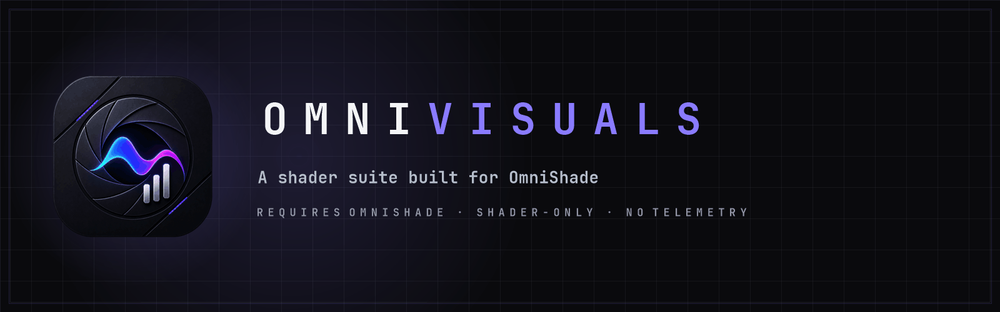

  

<h1 align="center">OmniVisuals</h1>

<strong>A coherent visual suite for OmniShade — 4K-focused lighting, reflections, atmosphere, reconstruction, color and HDR with clear performance paths.</strong>

Part of the <a href="#the-omnivex-suite">OmniVex</a> suite.

  
  &nbsp;&nbsp;
  

  
  
  
  
  
  

<!-- Quick navigation. These chips jump to a README section or maintained
     document. Keep fragment links aligned with GitHub's heading slugs. -->

  
  
  
  
  
  
  
  

> **Documentation repository.** OmniVisuals shader source, textures, presets, installer and release archives are not hosted on GitHub. Official distribution remains outside GitHub; the OmniVex donation links are below.

## One suite, one rendering language

OmniVisuals is an original clean-room shader suite designed specifically for OmniShade. Its effects share depth, motion, scene-cut, HDR and temporal conventions so the stack behaves as one pipeline instead of a folder of unrelated filters.

### Highlights

- **SingularityRT** — fused diffuse GI, visibility/contact AO, bent normals and roughness-aware reflections with Efficient and Quality paths.
- **NebulaGI + QuasarSSR** — separate high-control GI/AO and stochastic screen-space reflection route.
- **VectorNova + TemporalNexus** — motion estimation fallback, scene-cut state, reactive masks and HUD protection.
- **AstralVolume, SingularityDOF and CoronaBloom** — volumetrics, cinematic depth of field and controlled bloom/halation.
- **Photon AA/reconstruction family** — spatial or temporal anti-aliasing, clarity and chroma-preserving sharpening.
- **SpectraPilot, ChromaticOrbit and PrismLUT** — adaptive looks and managed LUT workflows.
- **NovaHDR** — SDR, scRGB, PQ and HLG-oriented output handling with conservative gamut protection.
- **SupernovaFinish** — fused finishing path that reduces separate 4K passes.
- Performance, Balanced 4K, Ultra 4K, Singularity and Fused profiles.
- Shader-only installation: no DLLs, hooks, APIs or add-ons.
- English, German, Spanish, French and Romanian installer UI.

## Requirements

OmniVisuals requires OmniShade 1.0.0 or newer in the target game. Setup verifies the configuration and runtime before installation. Results and cost depend on resolution, GPU, game buffers, HDR mode and selected effects.

## Honest rendering boundary

Screen-space effects cannot see hidden/off-screen geometry or reconstruct data the game never exposes. AutoLook cannot know monitor calibration or artistic intent from pixels alone. OmniVisuals supplies robust starting points, not a universal one-click guarantee.

## Getting OmniVisuals

OmniVisuals 1.0.0 is **free donationware**: payment is not required, there are no ads, and support is entirely optional. If it is useful to you and you want to fund continued work, use either official page:

  
  &nbsp;&nbsp;
  

GitHub contains no source, installer release or download mirror.

## Documentation

- [Feature overview](FEATURES.md)
- [Shader guide](SHADERS.md)
- [Frequently asked questions](FAQ.md)
- [Support](SUPPORT.md)
- [1.0.0 highlights](CHANGELOG.md)
- [Documentation license](LICENSE.md)
- [Repository and licensing notice](REPOSITORY_NOTICE.md)

## The OmniVex suite

OmniVisuals is one of a family of tools sharing a design language and a philosophy —
modern, fast, no telemetry:

**OmniTheme** · **OmniBlock** · **OmniCleaner** · **OmniAPO** · **OmniEQ** · **OmniPlay** · **OmniScale** · **OmniShade** · **OmniVisuals** · **OmniGPU** · **OmniWrappers**

**OmniWrappers** is four Direct3D compatibility installers — OmniDXVK, OmniDxWrapper, OmniVKD3D and OmniVoodoo2.
